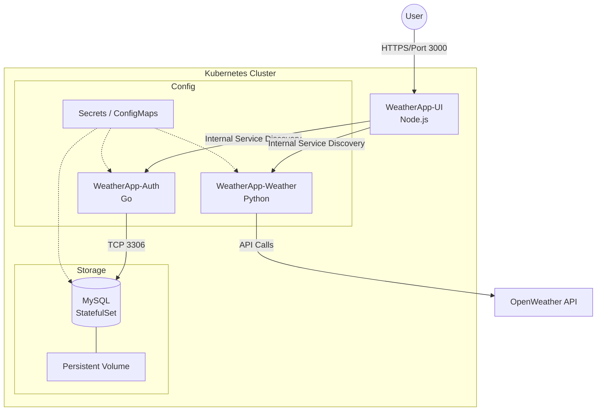

# Weather Stack: Multi-Service Kubernetes Deployment

A cloud-native weather application deployed on Kubernetes, featuring a polyglot microservices architecture. This project was developed as a hands-on capstone to master Kubernetes orchestration, service discovery, and persistent storage.

## 🏗 Architecture Overview

The application is split into four distinct components, each handling a specific domain:

1. **Frontend (UI):** A Node.js (Express.js) web interface that aggregates data from the internal services.
2. **Weather Service:** A Python-based service responsible for fetching real-time meteorological data via external APIs.
3. **Auth Service:** A high-performance Go service managing user authentication and JWT validation.
4. **Database:** A MySQL instance managed via a `StatefulSet` for data persistence.

### System Design



---

## 🚀 Key Kubernetes Features Implemented

- **Orchestration:** Managed via `Deployments` with configured `Liveness` and `Readiness` probes for self-healing.
- **Stateful Workloads:** MySQL is deployed using a `StatefulSet` with `volumeClaimTemplates` to ensure data survives pod restarts.
- **Service Discovery:** Internal communication is handled via `ClusterIP` and a `Headless Service` for the database.
- **Configuration Management:** \* **Secrets:** Securely handling JWT keys, API keys, and Database credentials.
- **ConfigMaps:** Fine-tuning MySQL performance (`my.cnf`) without rebuilding the image.

- **Database Initialization:** A Kubernetes `Job` is used to automate database schema creation and user permission granting upon deployment.
- **Security:** TLS secrets ready for Ingress integration and RBAC-ready configuration.

---

## 🛠 Tech Stack

| Service            | Language/Tool | Role                     |
| ------------------ | ------------- | ------------------------ |
| **UI**             | Express.js    | User Interface & Gateway |
| **Auth**           | Go            | Authentication Logic     |
| **Weather**        | Python        | Data Fetching            |
| **Database**       | MySQL 8.0     | Persistent Storage       |
| **Infrastructure** | Kubernetes    | Orchestration            |

---

## 📦 Deployment

### 1. Prerequisites

- A running Kubernetes cluster (Minikube, Kind, or Cloud provider).
- `kubectl` configured to point to your cluster.

### 2. Setup Secrets

Update the `weather-secret.yaml` with your Base64 encoded API key:

```bash
echo -n "your_api_key" | base64

```

### 3. Apply Manifests

```bash
# Apply secrets and configs first
kubectl apply -f app-secrets.yaml
kubectl apply -f auth/mysql-secret.yaml
kubectl apply -f auth/mysql/configmap.yaml

# Deploy the Database
kubectl apply -f auth/mysql/statefulset.yaml
kubectl apply -f auth/mysql/headless-service.yaml

# Initialize the Database
kubectl apply -f auth/mysql/init-job.yaml

# Deploy Services
kubectl apply -f auth/deployment.yaml
kubectl apply -f weather/deployment.yaml
kubectl apply -f ui/deployment.yaml

```

---

## 👨‍💻 Author

**[Mostafa Mahmoud]** _Completed as part of the "Kubernetes from beginner to master" course by Ahmed Elfakharany._
